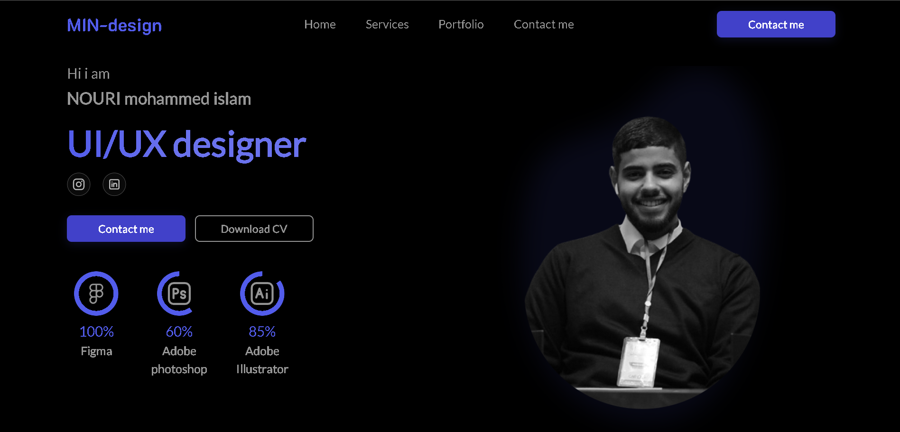

<h1>🎨 MIN-design – Portfolio Landing Page</h1>

A premium, modern, and fully responsive portfolio landing page built to showcase your work and attract clients.

    Responsive
    Bootstrap 5
    HTML + CSS + JS
    Premium Template

    
    
<a href="https://nassim255.github.io/ClientPortfolioLandingPage" target="_blank">🔗 Live Demo</a>

    <h2>📖 Overview</h2>
    <ul>
        <li>Fully responsive portfolio website</li>
        <li>Modern animations, smooth navigation, and clean design</li>
        <li>Showcase services, projects, and contact info with style</li>
    </ul>

    <h2>✨ Key Features</h2>
    <ul>
        <li>📱 Responsive Layout – Built with Bootstrap 5</li>
        <li>📂 Filterable Portfolio – All / Web Design / App Design</li>
        <li>🎠 Draggable Carousel with smooth snapping</li>
        <li>🖼 Modal & Overlay Popups for projects</li>
        <li>📬 Contact Form – Integrated with Web3Forms</li>
        <li>📜 Slide-Out Navigation Menu</li>
    </ul>

    <h2>🛠 Tech Stack & Resources</h2>
    <ul>
        <li><strong>Core:</strong> HTML5, CSS3, Bootstrap 5, Vanilla JS</li>
        <li><strong>Icons:</strong> Bootstrap Icons (CDN)</li>
        <li><strong>Forms:</strong> Web3Forms API</li>
        <li><strong>Optional:</strong> jQuery</li>
    </ul>
    <h3>CDNs Used</h3>
    

        Bootstrap CSS: https://cdn.jsdelivr.net/npm/bootstrap@5.3.7/dist/css/bootstrap.min.css 
        Bootstrap Icons: https://cdn.jsdelivr.net/npm/bootstrap-icons@1.10.5/font/bootstrap-icons.css 
        jQuery: https://code.jquery.com/jquery-3.6.0.min.js 
        Bootstrap JS: https://cdn.jsdelivr.net/npm/bootstrap@5.3.7/dist/js/bootstrap.bundle.min.js
    

    <h2>📂 Project Structure</h2>
    

        index.html         # Main HTML page 
        style.css          # Project styles 
        index.js           # Main JavaScript 
        assets/            # Images, icons, favicon 
        error404.html      # Custom 404 page
    

    <h2>💡 Highlights</h2>
    <ul>
        <li>Mobile-first design, works flawlessly on all devices</li>
        <li>Lightweight and fast-loading</li>
        <li>Easy to customize for your brand</li>
    </ul>

